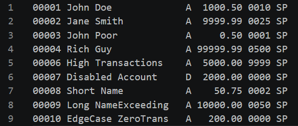
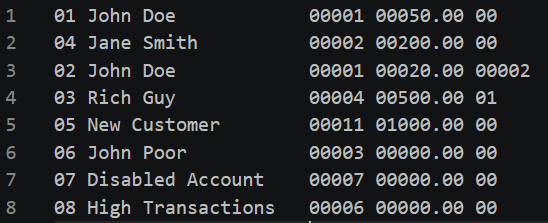

# Financial Transaction Processor

## Overview

This project simulates a banking transaction processing system that reads a master bank account file, processes a batch of transactions, and outputs an updated master file reflecting all changes.

The system is implemented in Python and demonstrates file handling, fixed-width data parsing, and basic transaction processing logic. Each account record contains structured fields such as account number, account holder name, status, and balance, which are parsed and updated as transactions are applied.

Transactions are processed sequentially with validation rules to ensure only permitted operations are executed based on account status and transaction type.

---

## Features

- Reads fixed-width bank account data
- Processes multiple transaction types (withdrawal, deposit, transfer, etc.)
- Supports account creation, deletion, and plan changes
- Validates input file formatting and handles errors
- Outputs an updated account file after processing

---

## How To Use

Run the following command from the terminal:

```bash
python main.py OldMasterBankAccounts.txt MergedBankAccountTransaction.txt output.txt
```

### File Descriptions

| File | Description |
|--------|-------------|
| OldMasterBankAccounts.txt | Initial snapshot of all bank accounts before any transactions are processed. |
| MergedBankAccountTransaction.txt | List of transactions that will be applied sequentially to modify the banking system. |
| output.txt | Final state of all bank accounts after all transactions have been processed. |

---

## File Details

### Bank Accounts File



#### Example Record

```text
00001 John Doe             A  1000.50 0010 SP
```

| Example | Field | Description |
|----------|----------|-------------|
| 00001 | Account Number | Unique 5-digit account identifier |
| John Doe | Account Holder Name | Name of the account owner |
| A | Account Status | A = Active, D = Disabled |
| 1000.50 | Account Balance | Current account balance |
| 0010 | Transaction Count | Total number of transactions |
| SP | Plan Type | SP = Student, NP = Normal |

### Transaction File



#### Example Record

```text
01 John Doe            00001 00050.00 00
```

| Example | Field | Description |
|----------|----------|-------------|
| 01 | Transaction Code | Identifies the transaction type |
| John Doe | Account Holder Name | Name of the account owner |
| 00001 | Account Number | Account associated with the transaction |
| 00050.00 | Amount | Transaction value |
| 00 | Misc Data | Information for certain transaction types |

### Transaction Codes

| Code | Transaction Type |
|------|------------------|
| 01 | Withdrawal |
| 02 | Transfer |
| 03 | Pay Bill |
| 04 | Deposit |
| 05 | Create Account |
| 06 | Delete Account |
| 07 | Disable Account |
| 08 | Change Plan |
| 00 | End-of-File Marker |

### Misc Data Usage

| Transaction Code | Misc Data Meaning |
|------------------|------------------|
| 01 (Withdrawal) | Not used (00) |
| 02 (Transfer) | Destination account number |
| 03 (Pay Bill) | Company identifier |
| 04 (Deposit) | Not used (00) |
| 05 (Create Account) | Account plan information |
| 06 (Delete Account) | Not used (00) |
| 07 (Disable Account) | Not used (00) |
| 08 (Change Plan) | New account plan information |

### Output File


The output file follows the same format as the bank accounts file and contains the updated account information after all transactions have been processed.
